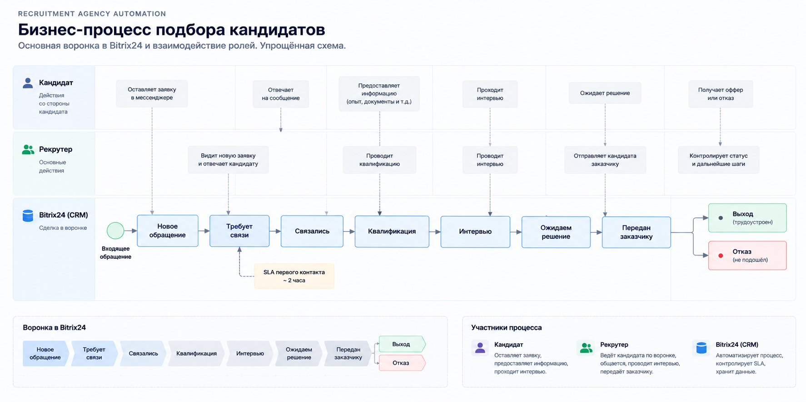
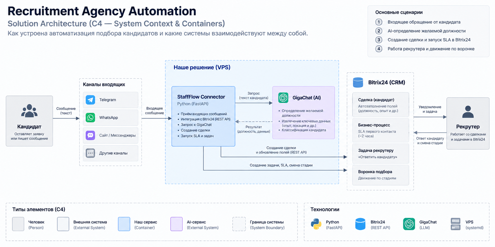
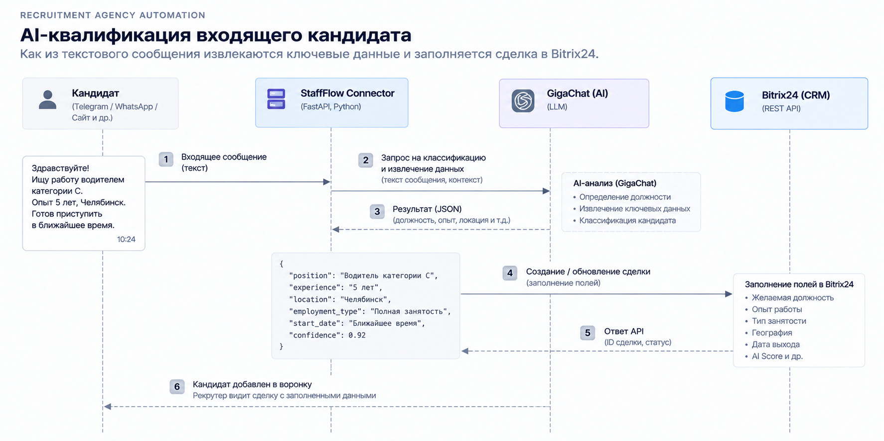
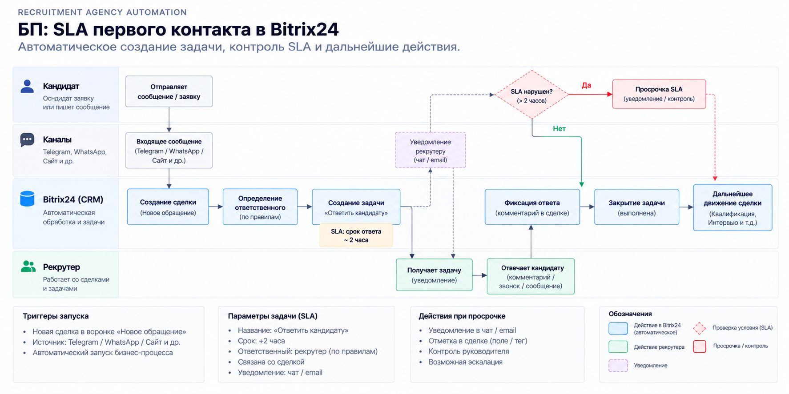

# Recruitment Agency Automation

Автоматизация обработки входящих кандидатов в Bitrix24 для рекрутингового агентства.

> **Incoming candidate → AI qualification → CRM → SLA → Recruiter → Interview → Decision**

## Задача

При большом количестве входящих кандидатов рекрутеру нужно быстро понять, на какую позицию подходит кандидат, зафиксировать данные в CRM и не потерять первый контакт.

Фокус кейса — не интерфейс Bitrix24, а автоматизация рабочего процесса вокруг CRM.

## Решение

Процесс разделён на несколько уровней:

1. **Бизнес-процесс** — кандидат проходит единую воронку от нового обращения до выхода на работу или отказа.
2. **Интеграция** — входящее обращение обрабатывается автоматизированным сервисом и передаётся в Bitrix24.
3. **AI-квалификация** — GigaChat определяет желаемую должность и извлекает ключевые данные из текста обращения.
4. **SLA первого контакта** — после создания сделки формируется задача рекрутеру с ограничением по времени реакции.

## Бизнес-процесс

Воронка построена вокруг реального сценария рекрутингового агентства:

**Новое обращение → Требует связи → Связались → Квалификация → Интервью → Ожидаем решение → Передан заказчику → Выход / Отказ**

Ключевая идея — в CRM фиксируется не только статус кандидата, но и следующее действие для рекрутера.

## Архитектура решения

Архитектура показывает взаимодействие основных компонентов: входящего обращения, интеграционного слоя, GigaChat и Bitrix24.

AI используется для обработки текста, а Bitrix24 остаётся системой, в которой хранятся данные кандидата, сделка, задачи и движение по воронке.

## AI-квалификация

AI-квалификация превращает неструктурированный текст обращения в данные, которые можно использовать в CRM.

Реальный сценарий кейса:

**«Ищу работу водителем категории C» → GigaChat → «Водитель категории C» → Bitrix24**

В результате создаётся сделка кандидата и автоматически заполняется поле **«Желаемая должность»**.

## SLA первого контакта

После появления нового кандидата запускается бизнес-процесс первого контакта:

- назначается ответственный рекрутер;
- создаётся задача **«Ответить кандидату»**;
- устанавливается срок реакции **+2 часа**;
- фиксируются срок реакции и следующий шаг;
- после ответа задача закрывается, а кандидат продолжает движение по воронке.

Отдельно предусмотрена обработка нарушения SLA.

## Что реализовано

- CRM-воронка подбора кандидатов
- автоматическое создание и заполнение CRM-сделки
- AI-определение желаемой должности
- передача результата AI в Bitrix24
- назначение ответственного
- SLA первого контакта
- автоматическая задача рекрутеру
- контроль срока реакции
- фиксация следующего шага
- переход кандидата по этапам подбора

## Результат

Вместо необработанного входящего обращения рекрутер получает структурированного кандидата в CRM с ответственным, сроком реакции и понятным следующим действием.

Автоматизация связывает **входящее обращение → AI-квалификацию → CRM → SLA → работу рекрутера** в единый процесс.

## Технологии

**Bitrix24 · REST API · Python · GigaChat**

## Case Study

Этот репозиторий — портфолио-кейс по анализу бизнес-процесса и его автоматизации в CRM.

Основной акцент — показать, как бизнес-требование превращается в конкретную CRM-логику, интеграцию и автоматизированный рабочий процесс.
